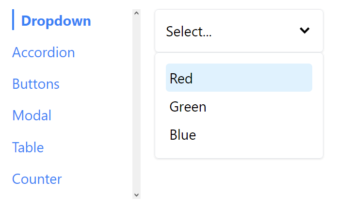
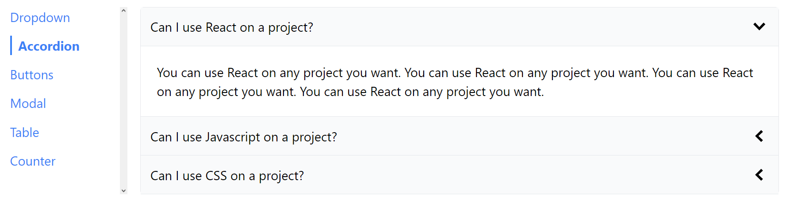
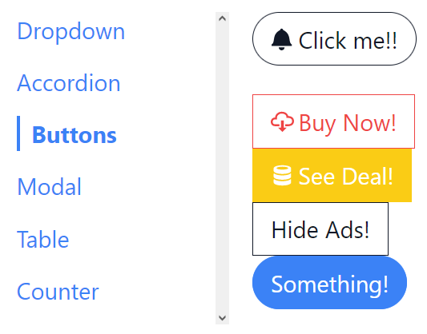
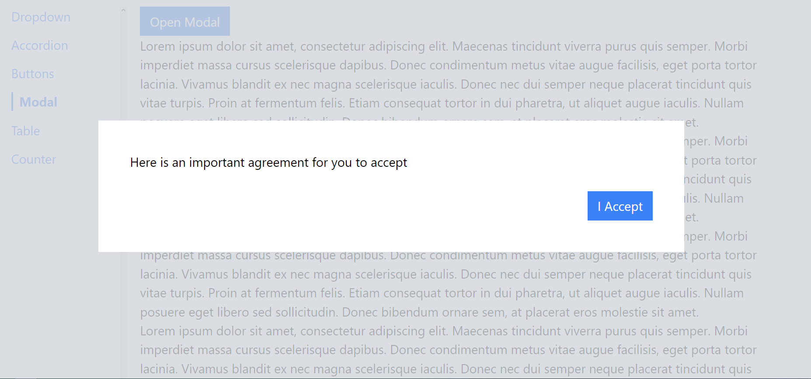
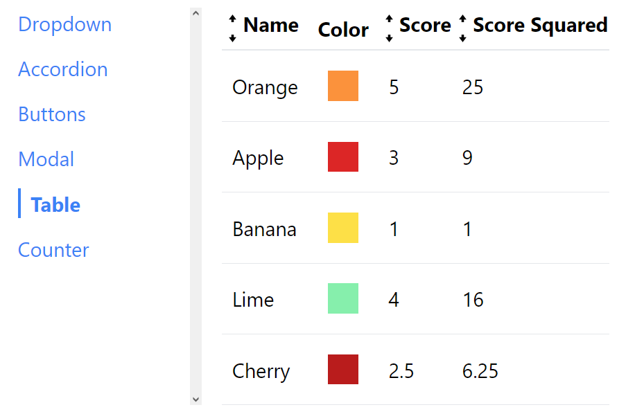
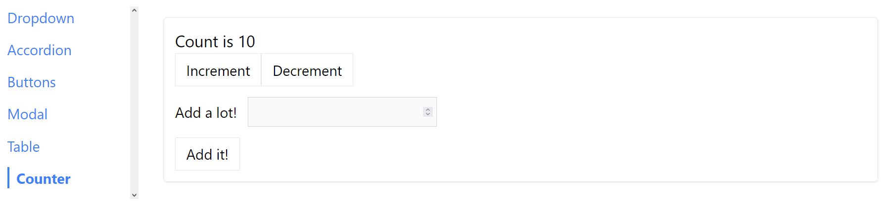
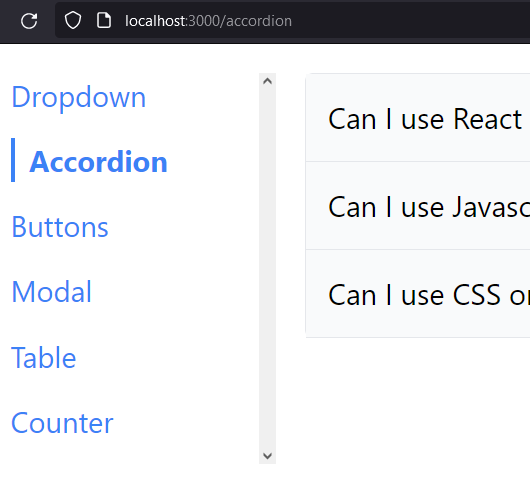

# Components

## Description

This React app uses a sidebar to navigate through different paths of the app. It employs multiple components, such as a dropdown, accordion, buttons, modal, table with sorting function, and counter page.

## Images

Here are some examples of the different sidebar paths that can be used to navigate through:

## Dependencies

This project uses the following dependencies:

- prop-types to validate that only one button variation is true at a time.

- prop-types
- Tailwind CSS framework to add style.
- classnames for conditionally joining classNames together.
- react-icons to add icons to buttons.
- immer to directly mutate the state coming from the Reducer function.

## Acknowledgments

This project is made possible by:

- [Stephen Grider](https://www.udemy.com/user/sgslo/) and his course [Modern React with Redux [2023 Update]](https://www.udemy.com/course/react-redux/).
